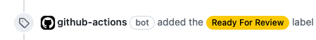
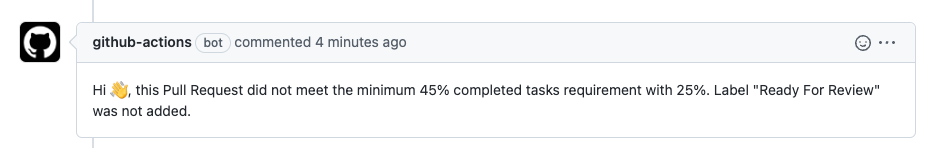

# ac-labeler

Labels based on AC met on a Pull Request (PR) type issue(s).

Examples:



or



## Inputs

## `label`

**Required** label to add on the PR if requirements are met.

## `minCompletedTaskCount`

**(Optional)** Minimum "integer" number of Completed Task PR needs to contain.

## `minCompletedTaskPercentage`

**(Optional)** Minimum % "integer" of Completed Task PR needs to contain. If `minCompletedTaskCount` is set, this field is ignored.

## Outputs

## `labelAdded`

Boolean of if the label was added or not.

## Example usage

```yaml
name: "Label the PR"

on:
  pull_request:
    types:
      - opened
      - reopened

jobs:
  main:
    name: Label the PR
    runs-on: ubuntu-latest
    steps:
      - uses: schoi-godaddy/ac-labeler@main
        env:
          GITHUB_TOKEN: ${{ secrets.GITHUB_TOKEN }}
        with:
          label: "Ready For Review"
          minCompletedTaskPercentage: 33
```
